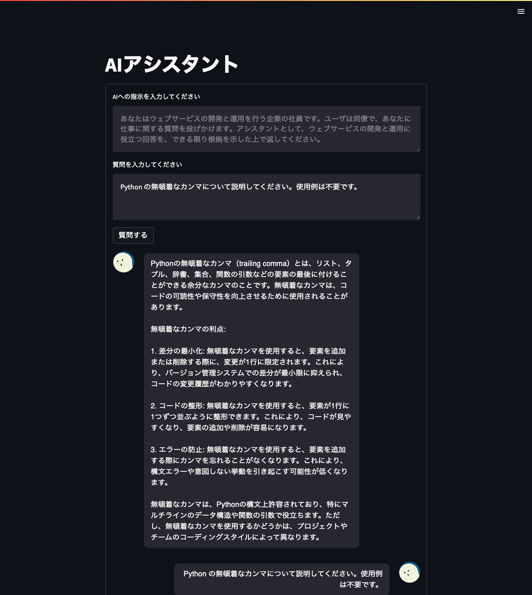

# ai-assistant

Interact with GPT-4 in a chat format in a browser.

## Screenshot



## Build & Run locally

```
docker build \
    --build-arg IMAGE_VERSION='1.0.0' \
    --build-arg SERVER_ADDRESS='localhost' \
    --build-arg BASE_URL_PATH='' \
    -t ai-assistant .
docker run \
    --network host \
    --env OPENAI_API_KEY="YOUR_API_KEY" \
    --rm -ti \
    ai-assistant
open http://localhost:8080
```

## Build on Google Cloud Build & deploy to Google Cloud Run

IMPORTANT: PLEASE ENSURE THAT ACCESS TO THE SERVICE IS RESTRICTED USING TOOLS LIKE IDENTITY-AWARE PROXY. Failing to do so may allow unauthorized individuals to send requests to OpenAI using your API key.

Put a config file with the following contents.

```yml
# cloud_build_config.yaml
steps:
- name: 'gcr.io/cloud-builders/docker'
  args: [
    'build',
    '--build-arg',
    'IMAGE_VERSION=${_IMAGE_VERSION}',
    '--build-arg',
    'SERVER_ADDRESS=${_SERVER_ADDRESS}',
    '--build-arg',
    'BASE_URL_PATH=${_BASE_URL_PATH}',
    '-t',
    'gcr.io/$PROJECT_ID/ai-assistant:${_IMAGE_VERSION}',
    '.'
  ]
substitutions:
  _IMAGE_VERSION: 1.0.0
  _SERVER_ADDRESS: 0.0.0.0
images: [
  'gcr.io/$PROJECT_ID/ai-assistant:${_IMAGE_VERSION}'
]
```

and, execute the following commands.

```sh
export BASE_URL_PATH="BASE_URL_PATH"
export GCLOUD_PROJECT="YOUR_GCLOUD_PROJECT"
export GCLOUD_REGION="YOUR_GCLOUD_REGION"
export SERVICE_ACCOUNT="YOUR_SERVICE_ACCOUNT"
gcloud builds submit --config=cloud_build_config.yaml --substitutions=_BASE_URL_PATH=/${BASE_URL_PATH}
gcloud run deploy ai-assistant --image gcr.io/${GCLOUD_PROJECT}/ai-assistant:1.0.0 \
    --region ${GCLOUD_REGION} --project ${GCLOUD_PROJECT} --platform managed --memory 1Gi \
    --service-account ${SERVICE_ACCOUNT} \
    --update-env-vars OPENAI_API_KEY=${OPENAI_API_KEY}
```


